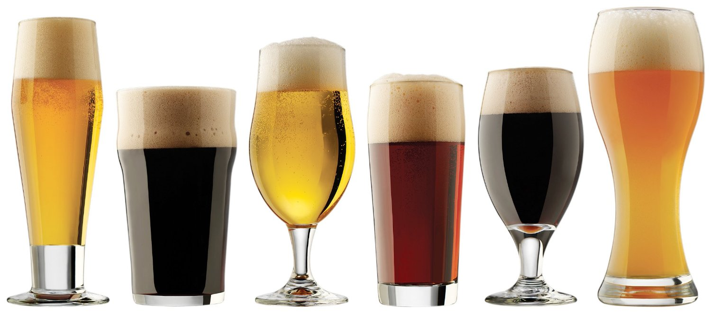
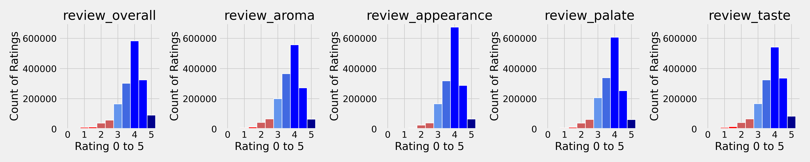
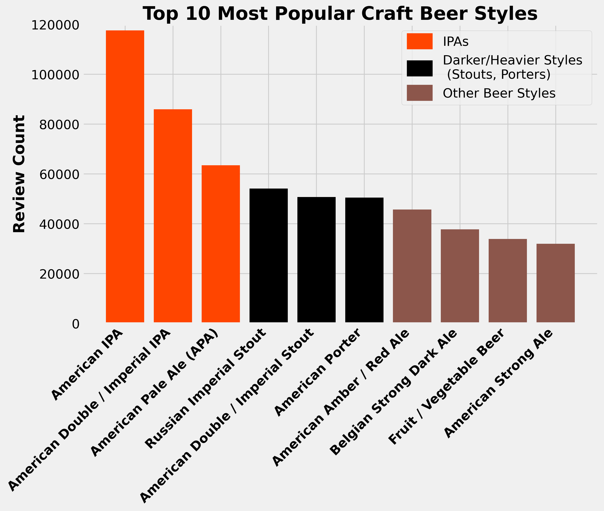
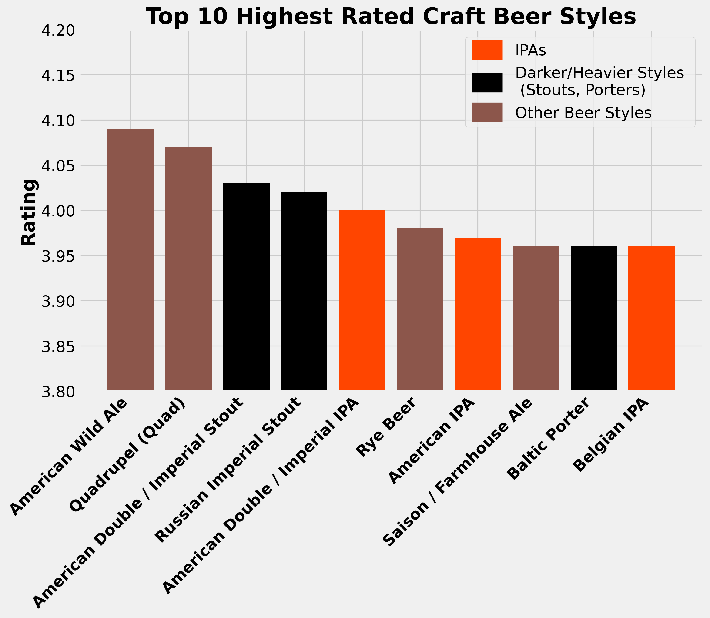
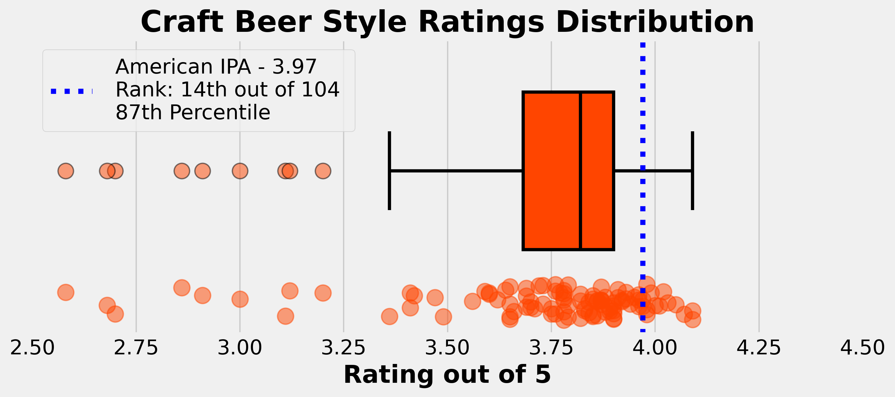

# Exploring Popular Craft Beer Styles

## Table of Contents
* [Introduction](#Introduction)
    * [Craft Beer Styles Overview](#Craft-Beer-Styles-Overview)
    * [Motivation](#Motivation)
    * [The Data](#The-Data)
* [Data Analysis](#Data-Analysis)
* [Answering Questions with the Data](#Answering-Questions-with-the-Data)
* [Main Takeaways and Further Work](#Main-Takeaways-and-Further-Work)
    * [Next Steps](#Next-Steps)
    * [What I Learned from this Project](#What-I-Learned-from-this-Project)

* [Photo and Data Credits](#Photo-and-Data-Credits)

  

# Introduction

## Craft Beer Styles Overview

While the majority of of beer sold in the US comes from a few companies (Anheuser-Busch InBev., Molson Coors) providing only a small selection of well known brands (Budweiser, Coors, Miller, etc.) and beer styles (adjunct lager, pale lager, etc.), there are actually hundreds of different styles of beer that are being brewed by breweries throughout the country and around the world. [CraftBeer.com](https://www.craftbeer.com/beer-styles) provides a great tool for learning about different styles of beer and finding new ones you might enjoy. A second good overview: [The Most Common Beer Styles, Explained](https://www.winemag.com/2020/09/03/most-popular-style-beer-guide/)

## Motivation

I moved to Colorado in 2016 and part of my motivation to call Colorado my new home was the prevalence of the craft beer industry in this state. I love exploring new breweries and trying new beer styles. The community feel to most local breweries really drew me in. While exploring various breweries throughout the state I realized that certain styles of beer like IPA's, Pilsners, and basic Lagers were extremely popular options while others like some of my favorites; Bocks, Amber/Brown Ales and darker styles like Porters and Stouts were less common. The motivation for my research was to see if my annecdotal experience of seeing IPAs as the most popular style matched up with the data. I also wanted to see if a beer style being popular also meant that it was highly rated or if these traits were not correlated. For example, the most popular beer style in america is probably adjunct lager (Bud Light, Budweiser, Coors, etc.) but I doubt these would show up as the highest rated or highest quality. Digging deeper I wanted to better understand the nuances of rating systems in general using craft beer reviews as a working model.

Beyond my personal interests and motivations, knowing how popular and how highly rated certain beer styles are, is a requirement for any well managed brewery or beer industry business. Having the right combination of beer styles in a brewery portfolio is one of the best ways to ensure that people keep coming back and buying more beer!

## The Data

The data I am exploring is a sample of ~1.5 million beer reviews from the beer review website BeerAdvocate.  

### About BeerAdvocate 
"BeerAdvocate is the go-to beer resource for millions of consumers each month and the benchmark for beer reviews. Founded by the Alström Brothers in 1996, BeerAdvocate (commonly referred to as "BA") is one of the oldest and largest online communities of enthusiasts and professionals dedicated to supporting and promoting better beer." [Learn More](https://www.beeradvocate.com/about/)

### About the Data 
At first glance the data is fairly well organized and mostly complete. The data counts and ratings features directly address my desire to explore beer style popularity and perceived quality. Unfortunately, the data is missing one feature (location) that would be useful during analysis. Another shortcoming of the dataset is a question regarding the independence of the data points. The data contains 13 features for each row and the original index serves as a 14th feature (review_id). Features include:
 
 |**Feature**|**Data Type** |**Notes**|
 |:---|:---|:---|
 |**Review Information**| |
 |review_time         |int64  |unknown datetime encoding|
 |review_profilename  |object-text string |who submitted the review|
 |**Ratings**| ||
 |review_overall      |float64|scale 0 to 5|
 |review_aroma        |float64|scale 0 to 5|
 |review_palate       |float64|scale 0 to 5|
 |review_taste        |float64|scale 0 to 5|
 |review_appearance   |float64|scale 0 to 5|
 |**Beer Information**| ||
 |beer_name           |object-text string ||
 |beer_abv            |float64|alcohol by volume|
 |beer_style          |object-text string |104 possible values|
 |beer_beerid         |int64  ||
 |**Brewery Information**| ||
 |brewery_name        |object-text string ||
 |brewery_id          |int64  ||
 
  

# Data Analysis
TODO - What methods did you use to analyze the data.
Why were these methods appropriate? How did you select
these methods? What other options did you have, and why
did you pass them over.

  

# Answering Questions with the Data

## Question 1:
## IPAs are in my experience the most popular style of craft beer. Does the data support my personal experience?

### Top 10 Beer Styles with the Most Reviews.
The **Review Count** grouped by the style of beer is used as an indicator of **Popularity**. 

  

## Question 2:
## Does being the most popular beer style indicate that IPAs are also the highest quality?

## Visual Evidence 

### Top 10 Highest Rated Beer Styles
* Data limited to styles with a minimum of 10000 reviews which left ~50% of all styles.
* Why? To avoid overrepresentation of low review count styles which have a higher chance of mean shifting as review count increases.

The **Mean Overall Rating** grouped by the style of beer is used as an indicator of **Quality**.

  

### Full Distribution of Beer Styles and American IPA's placement.

  

## Statistical Evidence - Hypothesis Tests
 
|Question 1|Is the mean rating of the American IPA (AIPA_mean) greater than the weighted mean of all styles combined (ALL_wmean)?|Question 2|Is the mean rating of the American IPA (AIPA_mean) greater than the mean of the highest rated beer - American Wild Ale? (HIGH_mean)|
|:---|:---|:---|:---|
|Null Hypothesis H0|AIPA_mean <= ALL_wmean           |Null Hypothesis H0|AIPA_mean <= HIGH_mean|
|Alternative Hypothesis HA|AIPA_mean > ALL_wmean   |Alternative Hypothesis HA|AIPA_mean > HIGH_mean        |
|Significance Level (Alpha)|0.05  |Significance Level (Alpha)|0.05       |
|Power| ~1.0                      |Power|   ~1.0                         | 
|Data|American IPA overall reviews **n=117586** and Weighted Mean of All Styles=**3.82**|Data|American IPA overall reviews **n=117586** and American Wild Ale overall reviews **n=17794**|
|Type of Test|One-Tailed One-Sample T-Test               |Type of Test|One-Tailed Mann-Whitner U                    |
|Test Statistic|81.5              |Test Statistic|896725652.5                   |
|P-Value| <0.001                 |P-Value| ~1.0                         |
|Result|Reject the Null Hypothesis|Result|Fail to Reject the Hull Hypothesis|
|Answer|There **is** statistically significant evidence that the mean rating of the American IPA is greater than the weighted mean of all styles combined.|Answer|There **is not** statistically significant evidence that the mean rating of the American IPA is greater than the mean rating of the highest rated beer style (American Wild Ale).|

  

## Conclusions:
### IPAs are the most popular style of craft beer.
### IPAs are not the highest quality style of beer but they are near the top.  

### When taken in combination with other factors such as cost and time requirements, the above conclusions can help craft beer brewers determine what styles of beer to provide for their customers.

  

# Main Takeaways and Further Work

## Next Steps

* Expand the functionality of my data pipeline to improve my ability to take in further data.
* Add more beer rating and review sources. The data in this project came from [BeerAdvocate](https://www.beeradvocate.com/) which is probably 2nd in this space. [Untappd](https://untappd.com/) is 1st by far so they would be the top target. 
Major reviews sites like Google Places, Yelp, Foursquare, Facebook, etc. could also be sources but it could be difficult to tease out the relavant data features.  

### Future Questions
* Do certain traits(appearance, taste, aroma, palate) of beers most represent the overall rating/review quality. Does this change based on the beer style? What trait is most indicative of the overall rating?
* How is the rating system weighted and organized? 
    * Example: Beer taste should probably be weighted more heavily than beer appearance. Is it? Is the overall rating a composite of the trait ratings or does it stand alone? 
* Is there variance in the data when compared across other data features such as reviewer, brewery, brewery location, and/or time? 
    * Examples: Are Darker/Heavier styles more common in winter? Does a particular region specialize in a certain type of beer? 

## What I Learned from this Project

### Importance of Data and Question Selection
* Watch out for large scale and systemic bias in your data. The BeerAdvocate dataset is biased towards the extreme end of the craft beer world and especially the overall beer world. The conclusions I reached based on this data may not hold true in broader context.
* Do the questions you are trying to answer actually relate to each other or do they just sound like they do? How does this change in the context of the data?
    * Digging deeper into a sub question or a conceptually related question is good.
    * Trying to answer 2 conceptually seperate questions leads to a disjointed focus.
* Try to only ask one question at the start and other questions will apppear as you explore the data.
* Does the data address the questions you want to answer or are you trying to force the data to match the question or vice-versa?
* Time required to do something is 2x to 5x the time expected to do something.  

### Philosophical Uncertainty Regarding Independent and Identically Distributed Random Variables (IID) 
* What constitutes independence? Can it really be achieved?
    * Are two seperate reviews of the same beer style, same beer brand, by the same person, at the same time independent?
    * If not, which aspects of style, brand, person and/or time need to be accounted for to determine independence?
    * Is it ever possible to have a data set with iid random variables? What level of independence is sufficient for various use cases? 
        * Example: My dataset is fairly large sample (1.5 million beer reviews) and from a top beer review source but even still it is heavily skewed in relation to the broader population and almost certainly not representative of the broader population. 

### Difficulty Curve of Data Collection - Webscraping/APIs   
* Pulling a formatted table from a web page - Easy
* Collecting data points individually in a non-static, multi-level search environment while dealing with rate limits, approval delays, odd search string formatting, string matching inconsistencies, encoded html tags, and general uncertainty about ethical, legal, and terms of use violations - Extremely Difficult 

# Photo and Data Credits  
**Cover Photo**:  The Bulletin  ["Drink more beer, urge Belgian brewers"](https://www.thebulletin.be/drink-more-beer-urge-belgian-brewers) - 10/16/2013  

**Main Data Source**: [BeerAdvocate](https://www.beeradvocate.com/) review data 
* Accessed through Kaggle ["Beer Reviews 1.5 millions of beers reviews"](https://www.kaggle.com/rdoume/beerreviews) 
* Provided by [Datadoume](https://www.kaggle.com/rdoume)
